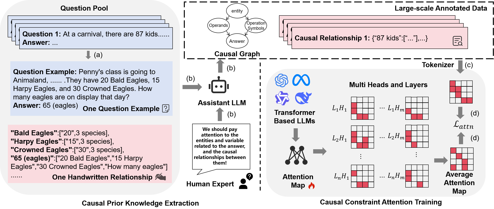
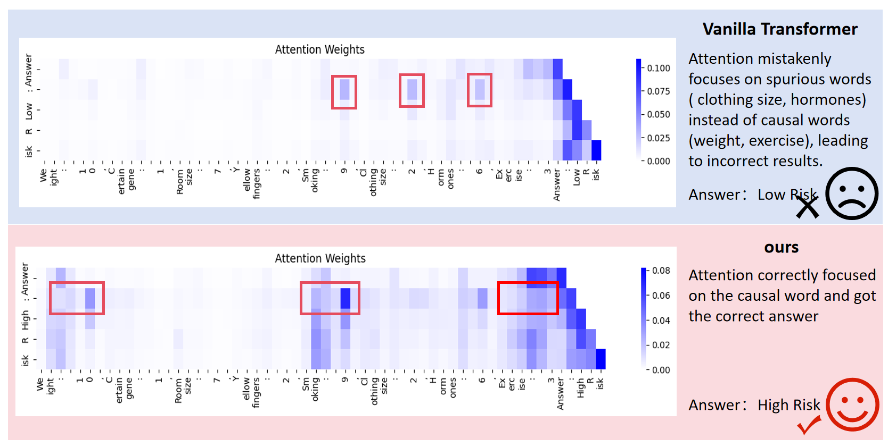
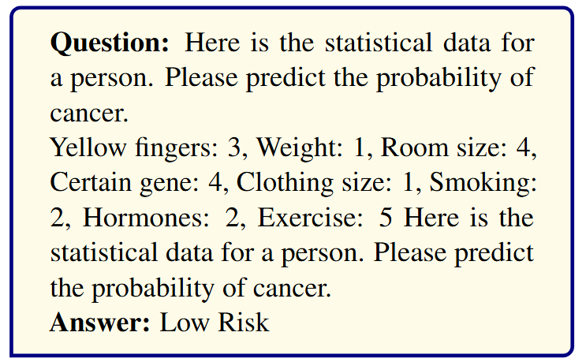

# <p style="display: flex; align-items: center; gap: 0.5em;">CAT: Causal Attention Tuning For Injecting Fine-grained Causal Knowledge into Large Language Models（EMNLP 2025）</p>

[](https://arxiv.org/abs/2509.01535)&nbsp;
## Description

Large Language Models (LLMs) have achieved impressive results in many domains. However, a critical question remains: **Can LLMs effectively utilize causal knowledge for prediction and generation?** Through empirical studies, we find that LLMs trained on large-scale data often capture spurious correlations rather than true causal relationships. This can lead to suboptimal performance, especially in out-of-distribution (OOD) scenarios.

To address this challenge, we propose **Causal Attention Tuning (CAT)**, a novel approach to inject fine-grained causal knowledge into the attention mechanism of LLMs. CAT introduces an automated pipeline that leverages human priors and domain-specific causal graphs to generate token-level causal signals, alongside a **Re-Attention mechanism** to guide training. This helps models focus on causal structures while reducing noise and biases in attention scores.

Experimental results on our **STG benchmark** and various downstream tasks demonstrate that CAT effectively leverages causal knowledge for prediction and remains robust in OOD scenarios.



---

## Directory Structure

```plaintext
dataset/
├── ARC_E/         
├── ASDiv/       
├── GSM8k/        
├── MAWPS/         
├── STG/              # Our STG dataset
├── STG_H/            # Our STG—H dataset
├── SVAMP/           

data_process/
├── batch_arc.py      # Batch processing for ARC dataset
├── batch_asdiv.py    # Batch processing for ASDiv dataset
├── batch_gsm8k.py    # Batch processing for GSM8k dataset
├── batch_svamp.py    # Batch processing for SVAMP dataset
├── convert_to_list.py # Utility script to convert data to list format
├── dataloader.py     # Data loader for preprocessing
├── myloss.py         # Custom loss function(s)
├── readme.md         # This README file
├── split_val.py      # Script to split data into training and validation
├── spurious_token_game_3.py # Generates STG dataset
└── test1_example.py  # Example script
```

---

## Main Scripts Explanation

* **`dataloader.py`**: Loads and preprocesses data for training.
* **`batch_*.py`**: Scripts for batch processing specific datasets.
* **`myloss.py`**: Defines custom loss functions for training.
* **`convert_to_list.py`**: Converts data into list format for easier manipulation.
* **`split_val.py`**: Splits the dataset into training and validation sets.
* **`spurious_token_game_3.py`**: Generates the Spurious Token Game (STG) dataset.
* **`test1_example.py`**: Example script showing how to test functionalities.

---

## Dependencies

To install the required dependencies, run:

```bash
pip install -r requirements.txt
```

---

## DEMO

Here is a sample output of CAT's performance. The figure below shows a comparison of attention distribution between causal words and spurious words during training:



---

## STG (Spurious Token Game)

Machine learning theory assumes that training and test sets are IID (Independent and Identically Distributed). However, due to spurious correlations, models may rely on factors that don't causally affect the outcome, which can compromise reliability.

In the **IID** scenario, the data follows the relationship:

$ \mathcal{C}^s_i, I^s_i \sim Rand(1, 10)$
$ \mathcal{S}^s_i = r_i * \mathcal{C}_i^s$
$ f(\mathcal{C}^s) = \sum_i k_i * \mathcal{C}^s_i$

For the **OOD** scenario, we break the proportional relationship:

$ \mathcal{S}^{ood}_i, \mathcal{C}^{ood}_i, I^{ood}_i \sim Rand(1, 10)$

A specific example is as follows:



For instance, the value of **yellow fingers** is 1.5 times that of **smoking**, and **clothing size** equals **weight**. Understanding these relationships is key to modeling causal dependencies and avoiding spurious correlations.

---

## Methodology: Causal Attention Tuning (CAT)

The CAT method consists of two major steps:

1. **Causal Prior Knowledge Extraction**:

   * Human experts manually write examples and generate causal supervision signals.
   * An assistant LLM automates causal supervision signals for large datasets.

2. **Causal Constraint Attention Training**:

   * We convert causal knowledge into an adjacency matrix and integrate it with the attention mechanism.
   * The **Re-Attention mechanism** guides training to ensure the model focuses on causal relationships during learning.

---

## Key Contributions

* **STG Benchmark**: Evaluates whether LLMs can capture causal knowledge.
* **CAT Framework**: Introduces fine-grained causal knowledge into LLMs using the Re-Attention mechanism.
* **Enhanced Generalization**: Our approach shows significant improvements in IID and OOD scenarios, ensuring robust performance in diverse tasks.

---

## Conclusion

CAT provides a novel solution to enhance LLMs by incorporating causal knowledge. Our experiments show that by focusing on causal factors, models become more robust and reliable, particularly in real-world scenarios where spurious correlations can undermine generalization.
